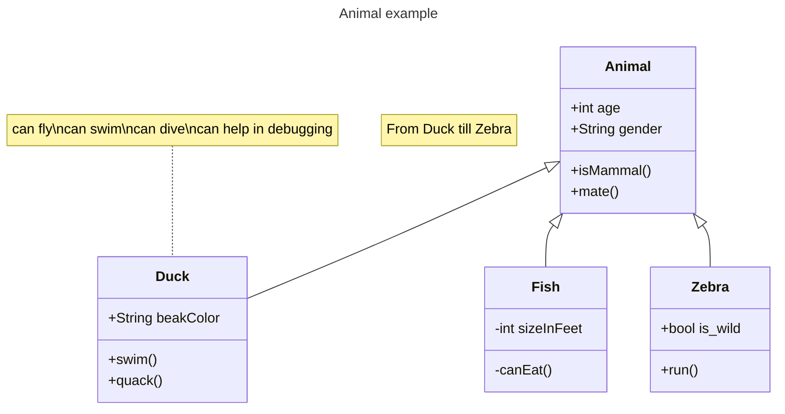

# improved-meme
A small showcase of a way to manage documentation simply, with releases

## Like math!

Judging by the intermediate errors I was receiving, the math is rendered by [$\KaTeX$](https://katex.org). The documentation on that site is pretty good, and if something is missing, the syntax is $\LaTeX$, of which there are many online references.

`$$\lim\limits_{x\to0} \dfrac{1}{1-x}$$` turns into:  
$$\lim\limits_{x\to0} \dfrac{1}{1-x}$$

## Tables!

Plaintext alignment of the pipes (`|`) is not necessary, but it helps the plaintext look nice.

| Column 1 | Column 2      | Result |
-----------|---------------|---------
| A value  | Another value | Result |
| Another row | What. Is. This?! | Result |

## Diagrams

Diagrams can be created using [Mermaid](https://mermaid.js.org/) code blocks.

